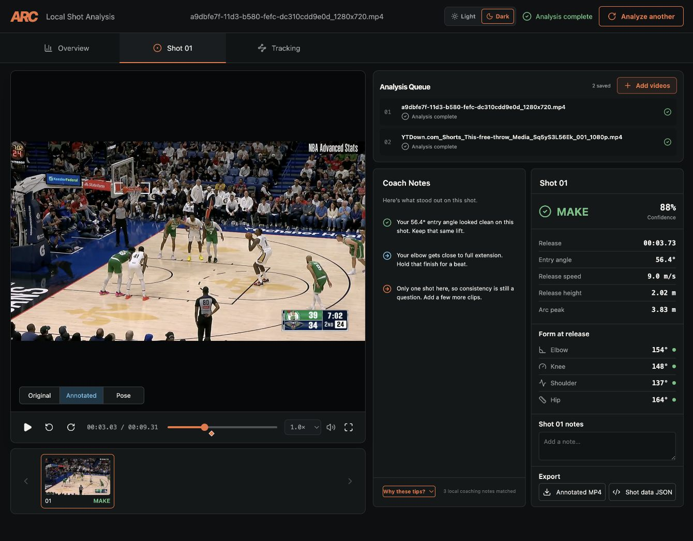
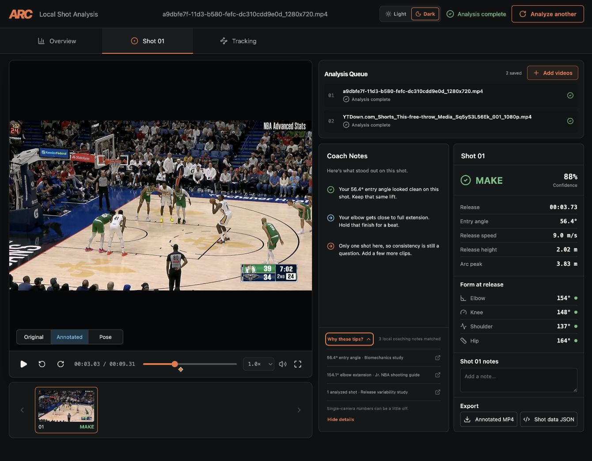

[Open the live ARC GitHub Pages demo →](https://stiwarilbj.github.io/Arc-Shot-Evaluator/)

The hosted demo opens in ARC Shot Analyzer; Playbook is the second tab for half-court diagrams and saved plays, and Play Finder is the third tab for searching a growing catalog of verified NBA plays

```bash
cd Arc-Shot-Evaluator
./scripts/setup.sh  #first run only
./scripts/start.sh
```

Then open <http://127.0.0.1:7888>. After the first setup, future runs only need:

```bash
./scripts/start.sh
```

If you downloaded the ZIP into another folder, change the `cd` path to that folder.

The setup script uses `pnpm` when it is installed and automatically falls back
to `npm` when it is not. You only need Node.js and `uv`; there is no separate
pnpm install step.

# ARC, basketball shot analysis and Playbook

I built ARC because rewatching a jumper and guessing what went wrong gets old fast; upload one video or a whole group, review the shot windows, inspect the replay, and keep a Playbook diagram beside the analysis 🏀

<p align="center">
  
</p>

*The video stays on the left. The queue, Coach Notes, and shot data all fit beside it, so you do not have to bounce between pages.*

## How it works

The website uses React, TypeScript, and regular CSS; the hosted build runs its normal browser review in the page with the supplied pose tracks, while the repository also includes the full FastAPI, OpenCV, PyTorch, and YOLO pipeline for development

ARC connects detections across frames, keeps track of the rim when the camera moves, and uses the visible regulation rim as a conditional 2D scale reference. It reports projected measurements only when the evidence supports them, and marks single-camera geometry as estimated or unavailable when it does not. Portrait video, blur, camera movement, and different resolutions are supported. Clear side views still give the best numbers, of course.

ARC also includes **Playbook** as a second tab for drawing half-court diagrams; start with the ready setup, a starter play, or an empty court, then drag markers, add movement, pass, screen, dribble handoff, or pick-and-roll actions, shape routes with curved control points, set their order and timing, and save diagrams or export a high-resolution PNG. Playbook’s local deterministic AI moves offense off ball, brings receivers into place before transfers, reacts to screens and handoffs, tracks defensive and off-ball quality, and ends each simulation with a shot; pause the simulation to edit the board and resume from the same moment. The hosted demo keeps saved plays in the browser; the development server stores them in the project’s `playbooks/` directory

The third tab, **Play Finder**, searches a growing catalog of reviewed NBA film with natural-language prompts and filters for players, teams, seasons, and verified play actions. Results explain which verified fields matched and link to the official NBA source; unknown clock, score, or coverage details are left unsupported rather than guessed. Save clips and notes in browser-based collections, find similar plays from shared verified features, and export or import collections as JSON. This catalog is a reviewed sample, not a search across every filmed NBA possession.

The overview keeps the observed make rate separate from future prediction. A
future FT% stays unavailable until a trained model has been evaluated on held
out shooters and calibrated; the observed confidence stays high for clean
form and drops when a miss or a made shot has severe release problems. Every
new clip uses the Normal analysis path.

Fresh sessions use the original Normal free-throw review path for every clip;
the restored example library includes the Celtics vs Pelicans set plus the
Kevin Durant, LeBron, Steph, and short free-throw clips. Supplied examples
also bring back the pose view with arm and leg projections and joint-angle
labels; the local FastAPI path keeps the complete calibrated shot metrics.

The accuracy and labeling protocol is documented in [docs/accuracy.md](docs/accuracy.md).

## The local Coach Notes

This part is basically a tiny RAG system without an online chatbot. ARC keeps a small local guide with paraphrased shooting ideas from Jr. NBA, USA Basketball, FIBA's WABC coaching workbook, and open biomechanics studies. A pure Python BM25-style search matches the shot's reliable measurements and footage quality to the right passages, then chooses three short human-written notes.

It says what looked good, gives one practice cue, and talks about consistency. It will not roast a shot just because it missed. If the footage is shaky or blurry, it admits the measurement might be off. The wording also stays the same when you refresh; that sounds small, but random advice would get annoying really fast.

<p align="center">
  
</p>

*Click “Why these tips?” to see the measurement and short source behind each note.*

## Where everything lives

The code is grouped by what it does. `backend/api` owns the local server and queue, `backend/analysis` owns vision and shot measurements, `backend/coaching` owns the local advice, and `backend/domain` holds the shared basketball types. The React side follows the same idea inside `frontend/src/features`.

There is a simple folder map and video data flow in [docs/architecture.md](docs/architecture.md).

## Why it feels different

- Browser review starts in the page with the normal pass and pose overlays; the repository also includes the full model pipeline for development runs.
- Two clips can analyze at the same time, while extra videos wait in the queue.
- If the net hides the ball, ARC checks the ball's reappearance and drop instead of blindly guessing.
- Weak evidence becomes `review`, and shaky footage gets careful advice instead of fake confidence.
- Results save to `sessions/` as annotated videos, JSON data, thumbnails, and coach notes.

The first local analysis can take longer while PyTorch loads the models. The home page has the supplied test clips ready to click. Uploads support MP4, MOV, M4V, AVI, MKV, WebM, MPEG, and more.

For terminal analysis, run:

```bash
.venv/bin/python -m backend.analysis.pipeline /absolute/path/to/clip.mp4
```

ARC uses the E-BARD basketball detector and Ultralytics YOLO11 Pose. Their links and license notes are included with the project.
